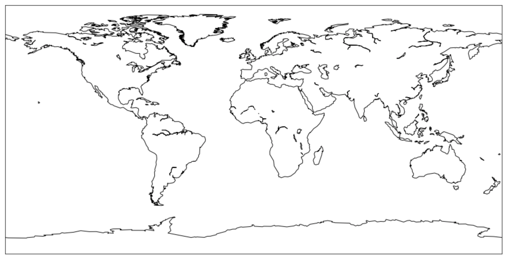

### mac系统下安装basemap失败（安装方法亲测可行）

#### 包介绍
`matplotlib`是`Python`常用的数据绘制包。它基于`numpy`的数组运算功能。`matplotlib`绘图功能强大，可以轻易的画出各种统计图形，比如散点图，条行图，饼图等。`matplotlib`常与`numpy`和`scipy`相配合，用于许多研究领域。他们是免费工具，但其功能足可以与科研界的大佬Matlab竞争。

`Basemap`是`Matplotlib`的一个子包，负责地图绘制。在数据可视化过程中，我们常需要将数据在地图上画出来。比如说我们在地图上画出城市人口，飞机航线，军事基地，矿藏分布等等。这样的地理绘图有助于读者理解空间相关的信息。

#### 环境
```
macOS 10.13.14
python  3.6.5
```

#### 安装办法详解
1. 下载`basemap`安装包

[https://pypi.org/project/basemap/](https://pypi.org/project/basemap/)

2. 解压到本地，打开终端，`cd`到该目录下
3. 安装`geos`
```
brew install geos
```
4. 写入环境变量，打开`~/.bash_profile`
```
查看 /usr/local/Cellar/geos/3.6.2/ 的版本号
运行
export GEOS_DIR=/usr/local/Cellar/geos/3.6.2
```
5. 安装`pyproj`
```
pip install pyproj
```
6. `basemap`安装包目录下运行
```
python setup.py install 
```
7. 安装ok

#### 检验
1. 打开`jupyter`的`python`调试环境
2. 输入代码
```
import matplotlib.pyplot as plt
from mpl_toolkits.basemap import Basemap

plt.figure(figsize=(16,8))
m = Basemap()
m.drawcoastlines()

plt.show()
```
3. 运行顺利看到结果，说明安装成功

