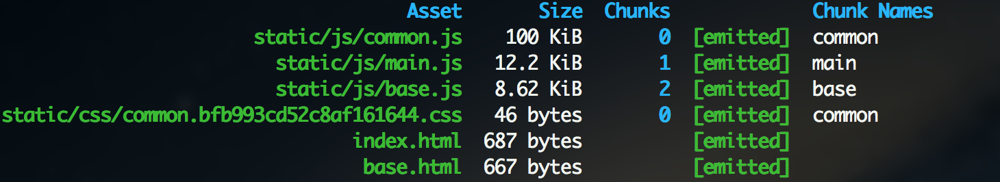

#### webpack.config.js

版本：
```
"webpack": "^4.16.2",
"webpack-cli": "^3.1.0",
"webpack-dev-server": "^3.1.5"
```
框架：
```
"react": "^16.4.1",
"react-dom": "^16.4.1"
```
or
```
"vue": "^2.5.16",
"vue-loader": "^15.2.6",
```

#### 通用配置
```
const path                      = require("path")
const webpack                   = require("webpack")
const chalk                     = require("chalk")
const HtmlWebPackPlugin         = require("html-webpack-plugin")
const CleanWebpackPlugin        = require("clean-webpack-plugin")
const ExtractTextWebpackPlugin  = require("extract-text-webpack-plugin")
const ProgressBarPlugin         = require("progress-bar-webpack-plugin")
const CompressionWebpackPlugin  = require("compression-webpack-plugin")
/***vue***/
//const VueLoaderPlugin           = require('vue-loader/lib/plugin')
const devStr                    = "mode == 'development'" ? "source-map" : ""

module.exports = {
    entry: {
        main: "./src/index.js",
        base: "./src/base.js"  //两个entry(都引用了react和react-dom)
    },
    output: {
        filename: "static/js/[name].js",
        path: path.resolve(__dirname, "dist"),
        publicPath: "/"
    },
    devtool: devStr,
    performance: { 
        hints: false  //文件超限提示
    },
    resolve: {  //导入的时候不用写拓展名
        extensions: [' ', '.js', '.json', '.vue', '.scss', '.css'],
        alias: {  //别名，import引入就不用../../src/templates
            Templates: path.resolve(__dirname, 'src/templates/')
        }
    },
    watchOptions: {
        ignored: /node_modules/, //不需要实时检测的内容
        aggregateTimeout: 300, //防止重复保存频繁重新编译,300ms内重复保存不打包
        poll: 1000  //每秒询问的文件变更的次数
    },
    externals: { //防止将某些 import 的包(package)打包到 bundle 中，而是在运行时(runtime)再去从外部获取这些扩展依赖(external dependencies)。
        'vue': 'Vue',
        'vue-resource': 'VueResource',
        'vue-router': 'VueRouter',
        'vuex': 'Vuex',
        'jquery': 'jquery',
    },
    module: {
        rules: [
            {
                test: /\.(js|jsx)$/,
                exclude: /node_modules/,
                use: "babel-loader"
            },
            {
                test: /\.html$/,
                use: "html-loader"
            },
            {
                test: /\.(scss|css)$/,
                use: ExtractTextWebpackPlugin.extract({
                    fallback: 'style-loader',
                    use: ['css-loader', 'postcss-loader', 'sass-loader']
                })
            },
            /***vue***
            {
                test: /\.(scss|css)$/,
                use: ExtractTextWebpackPlugin.extract({
                    fallback: 'vue-style-loader',
                    use: ['css-loader', 'postcss-loader', 'sass-loader']
                })
            },
            {
                test: /\.vue$/,
                use: 'vue-loader'
            },
            {
                test: /\.pug$/,
                use: 'pug-plain-loader'
            },
            */
        ]
    },
    plugins: [
        new CleanWebpackPlugin(["dist"]),
        /***vue***/
        //new VueLoaderPlugin(),
        new HtmlWebPackPlugin({
            template: path.resolve(__dirname, "src", "index.html"), //模板
            filename: "index.html",
            chunks: ["index", "common"], //多页面该项用于不同页面注入trunk不同
            //excludeChunks: ["index"], //跟chunks相反，该页面不注入谁
            /**
             *  demo
             *  new HtmlWebpackPlugin({
             *      template: 'src/html/index.html',
             *      excludeChunks: ['list', 'detail']
             *  }),
             *  new HtmlWebpackPlugin({
             *      filename: 'list.html',
             *      template: 'src/html/list.html',
             *      thunks: ['common', 'list']
             *  }), 
             *  new HtmlWebpackPlugin({
             *  filename: 'detail.html',
             *  template: 'src/html/detail.html',
             *  thunks: ['common', 'detail']
             *  })
             *  注：应用中配置了三个入口页面：index.html、list.html、detail.html；并且每个页面注入的thunk不尽相同；类似如果多页面应用，就需要为每个页面配置一个
             */
            hash: true, //防止缓存,静态资源添加hash参数
            minify:{
                removeAttributeQuotes: true //压缩 去掉引号
            }
        }),
        new HtmlWebPackPlugin({
            template: path.resolve(__dirname, "src", "base.html"),
            filename: 'base.html',
            hash: true,
            chunks: ['base', 'common'],
            minify: {
                removeComments: true,        //去注释
                collapseWhitespace: true,    //压缩空格
                removeAttributeQuotes: true  //去除属性引用
            }
        }),
        new ExtractTextWebpackPlugin({
            filename: 'static/css/[name].[hash:10].css'
        }),
        new webpack.HotModuleReplacementPlugin(),
        new webpack.NamedModulesPlugin(), //用户名替代id
        new ProgressBarPlugin({
            format: '  build [:bar] ' + chalk.green.bold(':percent') + ' (:elapsed seconds)'
        }), //显示打包进度
        new CompressionWebpackPlugin({ //gzip 压缩
            asset: '[path].gz[query]',
            algorithm: 'gzip',
            test: new RegExp(
                '\\.(js|css)$'    //压缩 js 与 css
            ),
            threshold: 10240,
            minRatio: 0.8
        })
    ],
    optimization: { //细粒度的缓存策略控制
        splitChunks: {
            cacheGroups: {
                commons: {
                    chunks: 'all',
                    minChunks: 2,
                    maxInitialRequests: 5, 
                    minSize: 0,
                    name: 'common'
                }
            }
        }
    },
    devServer:{
        inline: true,
        compress: true,
        host: '127.0.0.1',
        port: 2500,
        historyApiFallback: true
    }
}
```
这里`extract-text-webpack-plugin`在`webpack4`里已经不支持早期版本了。如果仍然要用，安装的时候可以加上`@next`，如下
```
yarn add extract-text-webpack-plugin@next -D
```
也可以用`mini-css-extract-plugin`，如下
```
yarn add mini-css-extract-plugin -D
```

#### 编译


这里`common.js`就是两个入口文件公共部分，分割成`chunk`，避免重复加载。
